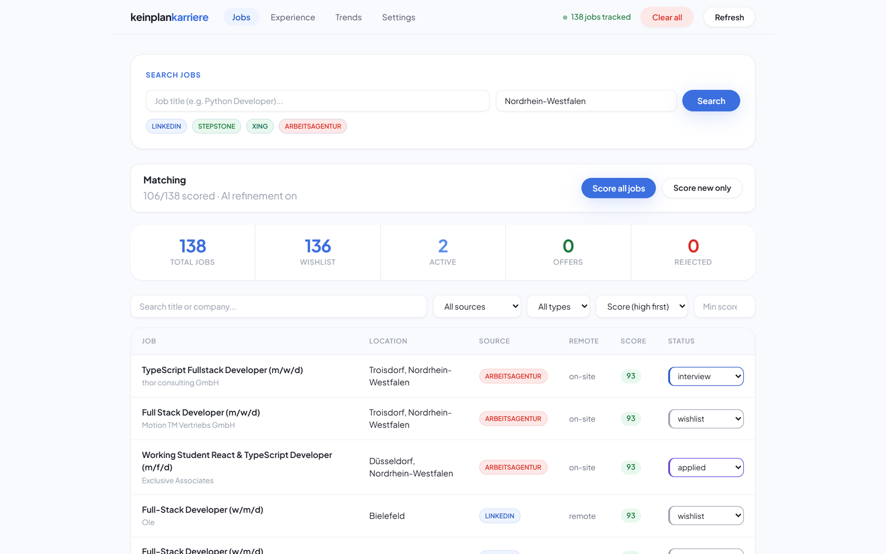
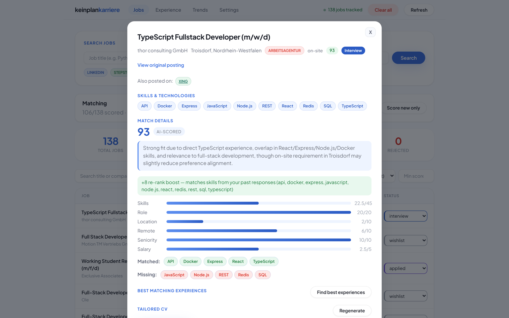
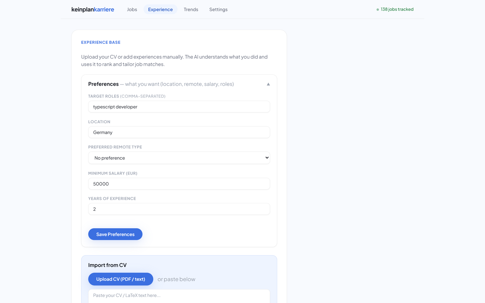
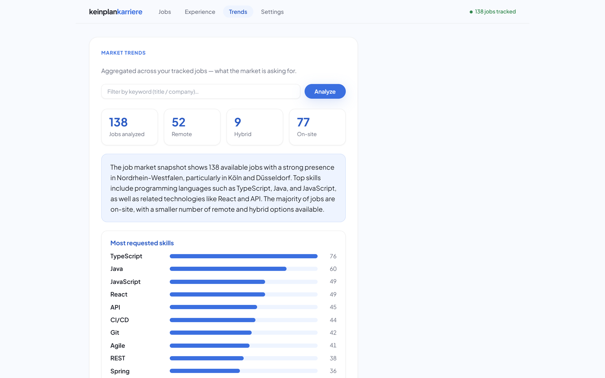

# KeinplanKarriere

> An AI career agent for the German tech job market. It collects postings from four job boards,
> ranks each one against **your real experience** with an explainable 0–100 score, and drafts a
> tailored CV and cover letter for the ones worth your time.
>
> It prepares the application — **you** press submit. This is not an auto-apply bot.

**🌐 Project website:** https://aminebenbelaid.github.io/KPK-agent/ — includes a self-running product walkthrough
**▶️ Run it yourself:** [one command with Docker](#quick-start-docker)
**📄 Pitch deck:** [`docs/KeinplanKarriere-Pitch.pdf`](docs/KeinplanKarriere-Pitch.pdf)

> **Why there is no public instance:** the agent scrapes job boards from your IP, stores your CV and
> generated documents locally, and calls an AI provider with your own key. Running it yourself keeps
> all three under your control — and it takes one command.



---

## Table of contents

- [What it does](#what-it-does)
- [Product walkthrough](#product-walkthrough)
- [Quick start (Docker)](#quick-start-docker)
- [Configuration](#configuration)
- [Architecture](#architecture)
- [How the matching engine works](#how-the-matching-engine-works)
- [Project structure](#project-structure)
- [API reference](#api-reference)
- [Local development](#local-development)
- [Development history](#development-history)

---

## What it does

| Stage | What happens |
|-------|--------------|
| **Find** | One search queries LinkedIn, StepStone, Xing and the Arbeitsagentur in parallel, fetches the **full description** of every posting, extracts the skills, and merges cross-board duplicates into a single entry. |
| **Match** | Every job gets a 0–100 score against your experience and preferences, with the component breakdown visible. Top candidates get an AI verdict that explains itself. |
| **Apply** | One click produces a CV rewritten for that job (all experience kept, wording pointed at the posting) plus a matching cover letter — both compiled to PDF — with the apply link and a checklist. |
| **Improve** | Marking a job as *interview* or *offer* creates a success signal: jobs sharing those skills rise in the ranking, and the AI scorer is told what has been working. |

### Supported job boards

| Platform | Method | Full descriptions |
|----------|--------|-------------------|
| **LinkedIn** | Guest search + `jobPosting` detail endpoint | ✅ |
| **StepStone** | HTML search + JSON-LD on the detail page | ✅ |
| **Xing** | HTML search + JSON-LD on the detail page | ✅ |
| **Arbeitsagentur** | Official public REST API | ✅ |

---

## Product walkthrough

The [project website](https://aminebenbelaid.github.io/KPK-agent/#walkthrough) contains a
self-running, five-step walkthrough of the product using real screens from the running app.

| | |
|---|---|
|  |  |
| **Score breakdown** — every component, plus which of the job's skills you match or miss. | **Apply Assistant** — tailored CV + cover letter as PDFs, apply link, checklist. |
|  |  |
| **Experience base** — parsed from your CV, reviewed by you before saving. | **Market trends** — in-demand skills, salary ranges, remote split, top locations. |

---

## Quick start (Docker)

Everything ships in one image — API, dashboard and the LaTeX engine. No local Python, Node or TeX needed.

```bash
# 1 · clone
git clone https://github.com/Aminebenbelaid/KPK-agent.git
cd KPK-agent

# 2 · configure
cp .env.example .env      # then edit: ADMIN_KEY (required), keys optional

# 3 · run
docker compose up -d --build

# 4 · open
open http://localhost:8000
```

Then, in the app:

1. **Settings** → paste an LLM API key. [Groq](https://console.groq.com) is free and works out of the
   box; OpenRouter, Kisski or any OpenAI-compatible endpoint also work.
2. **Experience** → upload your CV (PDF or LaTeX) and confirm what the AI extracted, or add entries by hand.
3. **Jobs** → run a search, then **Score all jobs**.
4. Open the best match → **Prepare application** → download the tailored CV and cover letter.

> Without an AI key, search, deduplication and rule-based ranking still work — only the
> generative features (CV parsing, tailoring, cover letters, AI refinement) require one.

**Useful commands**

```bash
docker compose logs -f kpk        # follow application logs
docker compose down               # stop (data survives in the kpk-data volume)
docker compose down -v            # stop and delete all data
```

The included `cloudflared` service can expose the app publicly over a Cloudflare Tunnel.
Remove that service from `docker-compose.yml` for a purely local install.

---

## Configuration

Environment variables (see `.env.example`):

| Variable | Purpose |
|----------|---------|
| `ADMIN_KEY` | Unlocks the owner workspace (Settings → Admin access) and the server-wide LLM settings. |
| `KISSKI_API_KEY` | Optional server-side LLM key, used **only** by the owner workspace. |
| `INTERNAL_API_KEY` | Shared secret the scrapers use to submit jobs to the API. |
| `TUNNEL_TOKEN` | Cloudflare Tunnel token, if you use the `cloudflared` service. |

In-app settings, per workspace (Settings tab):

- **Your LLM API key / base URL / model** — each visitor brings their own provider.
- **CV prompt add-ons** and **Cover letter prompt add-ons** — free-text guidance applied on every generation.
- **CV photo** — rendered into the top-right of the generated CV.

---

## Architecture

```
                Internet ──► (optional) Cloudflare Tunnel
                                  │
                    ┌─────────────┴──────────────┐
                    │      FastAPI application    │
                    │  · REST API (/api/*)        │
                    │  · serves the React build   │
                    │  · cookie session/visitor   │
                    │  ┌───────────────────────┐  │
                    │  │  serial work queue    │  │  scrape · score · generate
                    │  └───────────────────────┘  │
                    └───┬─────────┬──────────┬────┘
                        │         │          │
                   ┌────┴───┐ ┌───┴────┐ ┌───┴──────────┐
                   │Scrapers│ │ SQLite │ │ Tectonic     │
                   │4 boards│ │per-sess│ │ LaTeX → PDF  │
                   └────────┘ └────────┘ └──────────────┘
                                  │
                        OpenAI-compatible LLM (visitor's key)
```

**Multi-user design**

- **Session per visitor** — every browser gets an isolated workspace (jobs, experiences, profile,
  prompt add-ons, CV template, photo, generated PDFs), keyed by a cookie. Idle visitor
  workspaces are purged with their files after 48 h.
- **Owner workspace** — pre-existing data lives behind `ADMIN_KEY`; only the owner can see or edit
  the server-wide LLM credentials.
- **Serial work queue** — all expensive operations run one at a time, with the queue position shown
  in the UI, so several visitors cannot overload a small host.
- **Caps** — 400 jobs and 60 experiences per workspace, plus upload size limits.

---

## How the matching engine works

**Layer 1 — rule-based, every job.** Deterministic, instant, no API calls:

| Component | Weight | Notes |
|-----------|--------|-------|
| Skills | 45 | Share of the **job's** required skills you cover — more experience can only help |
| Target role | 20 | Token overlap between your target roles and the job title |
| Location | 10 | Your preferred region vs the posting (remote counts as a match) |
| Remote type | 10 | remote / hybrid / on-site preference |
| Seniority | 10 | Years of experience vs the level inferred from the posting |
| Salary | 5 | Against your floor, where the posting publishes a range |

**Layer 2 — AI refinement, top candidates only.** The language model reads the posting and your
actual experiences, re-scores 0–100 and writes a short justification.

- **Caching** — each score is fingerprinted from its inputs; re-running a pass reuses cached
  verdicts for unchanged jobs (a repeat run costs zero API calls).
- **Self-healing model choice** — if the provider retires or fails a model mid-request, selection
  re-resolves against the live catalogue and retries.
- **Re-ranking** — skills from positively-answered applications boost similar jobs.

**Supporting pieces**

- **Skill extraction** — ~70 canonical skills with aliases (React / ReactJS / React.js → one),
  word-boundary regexes so `Java` never matches inside `JavaScript`. German + English.
- **Deduplication** — titles/companies normalised (gender markers `(m/w/d)`, legal suffixes,
  punctuation removed) and compared with `difflib` similarity; matches merge and record “also on”.
- **Document generation** — LaTeX rewritten per job and compiled with Tectonic; on a compile
  failure it repairs once, then falls back to your known-good template.

---

## Project structure

```
├── src/
│   ├── main.py             # app factory, session middleware, static serving
│   ├── sessions.py         # per-visitor workspaces, owner claim, cleanup
│   ├── task_queue.py       # global serial worker for heavy operations
│   ├── init_db.py          # schema creation + migrations
│   ├── database.py         # SQLite helper (JSON column handling)
│   ├── config.py           # pydantic-settings configuration
│   ├── api/routes/         # health, jobs, applications, profile, experiences,
│   │                       #   matching, generate, settings, session, internal
│   └── matching/
│       ├── skills.py       # skill taxonomy + extraction
│       ├── dedup.py        # fuzzy cross-board deduplication
│       ├── scorer.py       # weighted rule-based scoring
│       ├── rerank.py       # outcome-based re-ranking
│       ├── llm.py          # provider-agnostic LLM layer (per-session credentials)
│       ├── cv.py           # CV parsing + experience↔job matching
│       ├── cvgen.py        # tailored CV generation (LaTeX → PDF)
│       ├── coverletter.py  # cover letter generation
│       └── report.py       # market trend aggregation
├── scrapers/               # linkedin, stepstone, xing, arbeitsagentur, base, run_all
├── cv_template/            # generic LaTeX résumé (per-session overrides live in data/)
├── dashboard/              # React 18 + Vite frontend
├── docs/                   # project website (GitHub Pages) + screenshots + deck
├── presentation/           # sprint decks (HTML) and the screenshot tooling
├── Dockerfile              # multi-stage: Node build → Python runtime + Tectonic
└── docker-compose.yml      # application + optional Cloudflare Tunnel
```

---

## API reference

| Method | Endpoint | Description |
|--------|----------|-------------|
| `GET` | `/health` | Health check + job count for the current workspace |
| `GET` | `/api/session` | Workspace identity, owner flag, queue state |
| `POST` | `/api/session/claim` | Unlock the owner workspace with `ADMIN_KEY` |
| `GET` `DELETE` | `/api/jobs` | List (filter/sort/search) or clear tracked jobs |
| `POST` | `/api/scrape` | Queue a scraping run; `GET /api/scrape/{id}` to poll |
| `POST` | `/api/score` | Queue a scoring pass; `GET /api/score` for an overview |
| `GET` `PUT` | `/api/profile` | Preferences (location, remote, salary, target roles) |
| `GET` `POST` `PUT` `DELETE` | `/api/experiences` | Experience base CRUD |
| `POST` | `/api/cv/parse-file` · `/api/cv/parse-text` | Parse a CV into experiences (queued) |
| `POST` | `/api/cv/tailor/{job_id}` | Generate a tailored CV (queued) |
| `POST` | `/api/cover-letter/{job_id}` | Generate a cover letter (queued) |
| `POST` | `/api/apply-kit/{job_id}` | CV + cover letter + apply link + checklist (queued) |
| `POST` | `/api/match/experiences/{job_id}` | Rank which experiences to highlight (queued) |
| `GET` | `/api/report` | Market trend report |
| `GET` | `/api/queue/{task_id}` | Poll any queued task (status + position in line) |
| `GET` `PUT` | `/api/settings` | Workspace settings (owner also sees server LLM settings) |

Queued endpoints return `{task_id, status, position}`; poll `/api/queue/{task_id}` until
`status` is `done` (the result is in `result`) or `failed`.

---

## Local development

```bash
# backend
python -m venv venv && source venv/bin/activate   # Windows: venv\Scripts\activate
pip install -r requirements.txt
uvicorn src.main:app --reload --port 8000

# frontend (second terminal)
cd dashboard && npm install && npm run dev         # :3000, proxies /api → :8000
```

CV/cover-letter generation needs the [`tectonic`](https://tectonic-typesetting.github.io/)
binary on `PATH` (it is installed automatically inside the Docker image).

---

## Development history

Built over four sprints, each ending with a running deployment:

| Sprint | Focus | Delivered |
|--------|-------|-----------|
| **1** | Collect & track | Four scrapers, FastAPI + SQLite backend, React dashboard, application status tracking, Docker from day one |
| **2** | Matching & profile | Skill extraction, fuzzy deduplication, weighted rule score + AI refinement, experience base parsed from a CV |
| **3** | Generation & apply | Full job descriptions from every board, tailored CVs, cover letters, Apply Assistant, market trends, outcome re-ranking, response caching |
| **4** | Multi-user & public | Per-visitor sessions, serial work queue, bring-your-own-LLM-key, CV photo upload, public deployment, project website |

Sprint notes: [`SPRINT2.md`](SPRINT2.md) · decks in [`presentation/`](presentation/).
Full commit history is in this repository.

---

## Design decisions worth knowing

- **No auto-apply.** Submitting applications automatically would breach job-board terms, require
  storing your credentials, and produce exactly the low-effort applications recruiters filter out.
  The agent prepares everything; a human sends it.
- **Deterministic first.** Deduplication, skill extraction and the base score are plain Python —
  fast, free and reproducible. The LLM is reserved for judgment: reading CVs, refining top
  matches, and writing documents.
- **Never fabricate.** Generated documents are grounded strictly in the reviewed experience base;
  prompts forbid inventing employers, dates, degrees or technologies.
- **Bring your own key.** Visitors use their own LLM provider, so no credentials are shared and
  hosting costs nothing.

---

*Built by [Amine Benbelaid](https://github.com/Aminebenbelaid) for the AI Agents course at
Westfälische Hochschule.*
